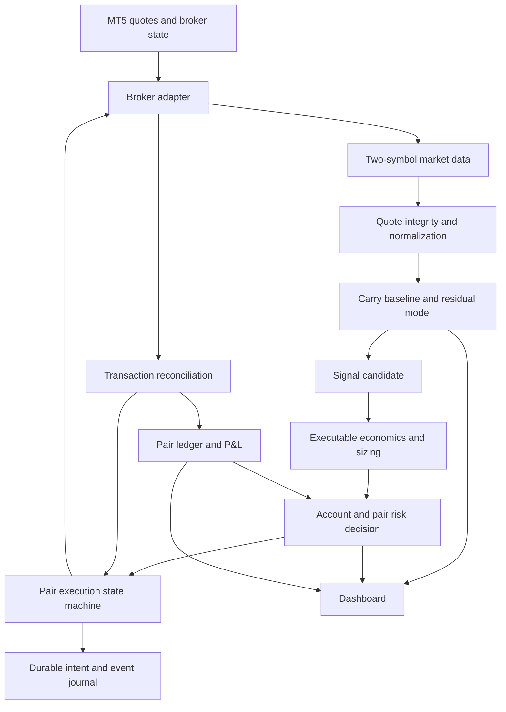

# Gold Basis EA — Strategy Feasibility and System Design

Prepared for Sahil Kukreja • 17 September 2026 • Proposed design, version 1

**Review status: `/arb-hostile-review` NOT READY (2026-09-18), as a basis for adopting A4 or beginning
implementation.** The document's own architecture (sections 6–12) holds up well and is a credible reference.
The document's own central premise — that the carry-baseline residual mean-reverts on a tradeable timescale —
had no measurement anywhere in this repository at review time; two of the review's mandatory tests have since
been run (see `docs/02_quant/12_FAIR_VALUE_MODEL.md` "Residual dispersion and reversion," 2026-09-18) and both
came back *more* favorable than the review speculated, though still short of establishing tradeable edge.
§4.3's swap-calendar correction is very likely incorrect — see the same date's chat record; this project's own
`×9/7` figure is sourced and matches standard MT5 triple-swap convention. Not accepted as A4. Kept as a
tracked reference, not a legacy quarantine item — it is a live candidate pending further evidence, not
superseded material.

## Decision

Design a **single-broker, intraday relative-value EA** for `XAUUSD.vx` and `GC-Z26`, centred on **expiry-adjusted basis residual mean reversion**. Use robust deviation bands, a regime filter, and executable-price economics. Support both directions in the design, but enable each direction only if its own economics justify it.

This is a strategy and architecture proposal, not a claim that profitable signals have already been established. Its purpose is to supply the missing A4 signal specification and a coherent downstream system design. It does not change the repository's economic/design gates or authorize further live trading.

The practical edge hypothesis is: *temporary deviations from this broker's normal spot–futures relationship sometimes reverse far enough, while both quotes remain genuinely executable, to pay all costs and compensate for uncertainty.* Neither a large raw gap nor fast execution creates that edge.

Initial scope: one account, one terminal, one contract pair, one active hedge, contract-matched minimum volumes, no averaging, no automatic roll, no daily profit target. The USD 1,000 capital ceiling remains a constraint, not a reason to loosen the design.

## 1. Evidence and its limits

Repository reviewed at [`dae2f3f`](https://github.com/sahilkukreja/mt5-spot-futures-arbitrage/commit/dae2f3fe9058e5e415709b744237067d994aec3d). The latest default-branch commit remains the Stage 3/4 rejection record. The requested signal document, `docs/02_quant/15_SIGNAL_RESEARCH.md`, is absent at that revision.

The attached master and historical EA context were read in full. They supply fixed OAG/CAG, rolling z-score, cost-of-carry, profit-floor, async execution, session controls and roll ideas. The workbook's earlier reconciliation is context only: it was not recomputed for this design. Historical profit from another account does not establish the same edge at VPFX, nor does it reconstruct intraday equity drawdown.

| Repository observation | What it supports | What it does not establish |
|---|---|---|
| Implied annual carry median about 4.71% across the wider sample | Normalize for spot price and time to expiry | A 4.71% return available to the trader |
| Roughly 23% of average basis not explained by the document's SOFR comparison | Model a broker-specific baseline | That the residual premium must disappear |
| Historical basis drift about −$0.3905/oz per calendar day | A simple overnight convergence trade faces financing drag | The expected move after a conditional intraday entry |
| Median intraday basis range $7.91/oz | There is variation worth modelling | An entry can capture the high–low range |
| Historical ordinary round-trip cost about $0.4975 for a 1 oz pair, before slippage | An indicative economic hurdle | A fixed future cost or an extreme-event loss bound |
| Raw-basis half-life changed dramatically with sample/grid | Raw dollar basis is a poor fixed equilibrium variable | A detrended residual is automatically stationary |
| R-004 includes stale spot prices with narrow spread | Quote integrity must precede signal generation | Every unusual basis value is tradeable mispricing |

These are repository-reported measurements, not fresh broker quotes or independently reproduced statistical results. The 7-day and wider samples overlap; they are not independent replications. Ordinary OLS uncertainty may understate time-series uncertainty. A calculation mode identifying a CFD does not, by itself, document the broker's legal settlement or roll terms.

Sources: [fair value][R12], [basis model][R13], [cost model][R14], [expected value][R17], [risk register][RR].

## 2. All twelve candidate approaches in the mandate

Several entries are representations or filters within one strategy, rather than twelve separate sources of return.

| Approach | Useful role | Main weakness | Design decision |
|---|---|---|---|
| 1. Absolute basis / fixed OAG–CAG | Transparent comparison baseline | Threshold becomes obsolete as expiry and gold price change | Retain as benchmark/manual display; not primary automatic signal |
| 2. Percentage basis `(F−S)/S` | Removes gold price scale | Still changes with remaining maturity | Use as an intermediate feature |
| 3. Normalized price ratio `F/S` or `ln(F/S)` | Consistent relative-price representation | A ratio above one is normal carry, not profit | Use log ratio before expiry normalization |
| 4. Rolling z-score | Identifies unusual residuals | Trends, bad quotes and tiny estimated variance create false extremes | Apply only to cleaned, normalized residuals |
| 5. Dynamic basis model | Adapts slowly to broker baseline changes | A fast model can absorb the very deviation being traded | Slow, causal baseline; explicit model version |
| 6. Theoretical futures fair value | Explains carry and provides a sanity check | Retail financing and CFD construction differ from physical replication | Diagnostic reference, not standalone buy/sell rule |
| 7. Time-to-expiry-adjusted basis | Removes a major structural drift source | Annualization becomes unstable close to expiry | Core representation, with contract cutoff |
| 8. Volatility-adjusted spread | Expresses deviation relative to normal noise | Low volatility does not make tiny dollar moves profitable | Filter/standardization; always retain dollar economics |
| 9. Percentile-based deviation | Handles skew better than symmetric normal bands | Rare does not mean reversible | Secondary candidate on the same residual |
| 10. Mean-reversion / OU or AR model | Estimates direction and horizon of expected correction | Unstable parameters or jumps invalidate the model | Primary economic hypothesis; forecast conditional outcomes |
| 11. Regime-aware model | Switches off during dislocations or changed relationships | Overcomplicated classification can overfit | Simple observable states first |
| 12. Transaction-cost-adjusted signal | Rejects attractive-looking but uneconomic moves | Cannot manufacture predictability | Mandatory gate for every candidate |

Recommended combination: **7 + 5 + 4 (or 9) + 10 + 11 + 12**, expressed as one understandable strategy. Do not assemble a voting ensemble from highly correlated versions of the same gap.

## 3. Comparison with online approaches

### Fixed-gap commercial spot–futures EA

The [MQL5 Spot vs Future Gold Arbitrage EA][MKT] publicly describes long spot/short futures, entering and closing at spread targets. That closely matches the historical OAG/CAG concept. Its public description does not establish a carry-adjusted equilibrium, conditional net expectancy or atomic execution. Borrow the clear pair-management workflow, not its implied profitability.

Its [linked public Signal][SIG] is evidence that an account is presented, not proof that this strategy is transferable to VPFX. A public return curve cannot isolate parameter changes, financing, deployment conditions or paired intraday risk. Do not dismiss account drawdown as a reporting artifact merely because legs offset.

### Statistical pairs trading and Kalman models

[Palomar's pairs-trading treatment][PAIR] builds the trade around a reverting spread, rather than independent directional forecasts. [The Kalman chapter][KALMAN] describes time-varying mean and hedge-ratio estimation. These provide legitimate modelling approaches; they do not demonstrate an edge for these two CFDs.

Design inference: start with a slow robust implied-carry baseline. A Kalman estimate of that baseline is a challenger if a simpler model cannot track ordinary changes. Keep statistical prediction coefficients separate from actual hedge sizing: fitting beta to noisy prices must not silently create a directional gold position.

### Exchange and inter-metal spreads

[CME's metals spread discussion][CME] covers relative-price trades including inter-commodity spreads. These are useful examples of relationship trading; they are not risk-free and do not imply equal ounces or equal lots across different metals. A gold–silver strategy would require its own economic model and is outside this EA's initial scope.

### Other plausible routes

| Route | Economic source | Fit for this EA |
|---|---|---|
| Physical cash-and-carry | Lock an executable futures sale against funded, deliverable inventory and all carry costs | Different infrastructure and capital model; a spot CFD does not supply deliverable inventory |
| Overnight long spot / short futures | Basis decay minus spot financing | Unattractive under recorded costs; exclude as the default thesis |
| Reverse carry / swap harvesting | Short-spot swap credit minus basis decay | Very thin and broker-dependent; exclude from version 1 |
| Futures calendar spread | Changes in relative pricing of two expiries | Sensible future research; requires two available contracts, costs and settlement rules; not currently established |
| Cross-broker spot or futures arbitrage | Temporary difference between executable venue prices | Additional account funding, incompatible margin pools and execution risks; defer |
| Fast-feed / stale-quote latency arbitrage | Trade before a slower venue reprices | Conflicts with this design's quote-integrity premise; exclude |
| Passive first-leg limit order plus hedge | Potentially reduce spread paid | Adverse selection and uncertain fills; execution-policy challenger, not a new edge |
| Grid, martingale, adding as basis worsens | Enlarges exposure while waiting for recovery | No independent source of edge; incompatible with initial capital policy |
| AI/ML entry predictor | Potential nonlinear forecast from richer features | No demonstrated advantage here; defer rather than add complexity |

The previously referenced [ATJ gold-arbitrage article](https://www.atjresearch.com/post/gold-arbitrage) could not be retrieved in this review. Search surfaced related content but not enough inspectable method or results to treat it as feasibility evidence. No strategy claims from it are adopted.

## 4. Economic corrections that change the design

### 4.1 Spread must be counted once

For one matched ounce, define:

`B_sell = futures_bid − spot_ask`

`B_buy = futures_ask − spot_bid`

Short basis means BUY spot / SELL futures. Its quoted entry-to-exit price P&L is:

`P_short = B_sell(entry) − B_buy(exit)`

Long basis means SELL spot / BUY futures:

`P_long = B_sell(exit) − B_buy(entry)`

Multiply by matched ounces Q. These executable-price formulas already incorporate both legs' bid/ask costs. Subtract commissions, fees, signed financing costs and slippage relative to those reference quotes; do not subtract spread again.

If using midprices instead, the spread cost is:

`Q × 0.5 × [spot_spread(entry) + futures_spread(entry) + spot_spread(exit) + futures_spread(exit)]`

With unchanged spreads this is **one spot spread plus one futures spread**, not twice that sum. The attached master's `2 × (spread_spot + spread_future)` overstates this particular mid-based round-trip cost by two times.

Illustration, not a signal: B_sell(entry)=42.00 and B_buy(exit)=40.80 earns $1.20 at Q=1 before commission and additional execution effects. With $0.10 commission and $0.20 total adverse slippage, net is $0.90. The profit was never the full $42 gap.

### 4.2 Profit-only exits are not a complete strategy

Normal profit-taking may require a positive net target. Loss, maximum-hold, model-invalidity and pre-financing deadline exits must remain able to close a losing pair. Otherwise an intended intraday strategy becomes an unplanned carry strategy precisely on its losing trades.

### 4.3 Potential swap calendar error

The repository multiplies a $0.60 base daily debit by 9/7, seemingly charging seven calendar days plus two extra days for Wednesday. That may count the weekend twice. MT5 exposes per-weekday swap multipliers; a triple day alone does not establish the complete charging schedule. [MetaQuotes symbol properties][SPEC]

Under a **hypothetical conventional schedule of five rollovers, one triple and four single**:

| Quantity, Q=1 | Repository calculation | Conventional-schedule illustration |
|---|---:|---:|
| Long spot debit per calendar day | $0.7714 | $0.6000 |
| Short spot credit per calendar day | $0.5143 | $0.4000 |
| Long spot / short futures carry after observed decay | −$0.3809/day | −$0.2095/day |
| Reverse carry after observed decay | +$0.1238/day | +$0.0095/day |

The actual broker schedule remains unconfirmed. Long-spot carry is still negative in this illustration; reverse carry would require about 52.4 calendar days merely to recover a $0.4975 round-trip cost, excluding slippage and basis uncertainty. Use actual rollover events, holidays and weekday multipliers rather than assuming either schedule. The reported drift confidence interval is not a forward guarantee, and negative unconditional carry does not mathematically rule out every exceptional conditional overnight opportunity.

### 4.4 Carry is a model component, not always an extra fee

Do not subtract theoretical carry again after forecasting the full change in executable basis. Actual swap, commission and financing cash flows are costs. Expected maturity-driven basis movement belongs in the price forecast. Keep these accounting categories separate.

## 5. Proposed signal specification — the missing A4

### Representation and baseline

For coherent spot/futures midquotes and a verified contract expiry:

```
tau_t = remaining_time_in_years
r_t   = ln(F_mid_t / S_mid_t) / tau_t
r_hat = lagged robust estimate of this broker/contract's normal implied carry
B_hat = S_mid_t × [exp(r_hat × tau_t) − 1]
x_t   = (F_mid_t − S_mid_t) − B_hat
```

`r_hat` includes persistent broker premium: do not presume the entire difference from a public funding rate is exploitable. Begin with a trailing robust location estimate on time-sampled valid quotes; add session effects only if persistent. Estimate from information available strictly before the current decision. Exclude invalid quotes from learning, and freeze updates during a detected dislocation.

Compute a robust score from dollar residuals: `z_t = (x_t − lagged_median(x)) / (1.4826 × lagged_MAD(x))`. The factor is a normal-distribution scaling convention, not a claim that tails are normal. A tiny or unavailable scale produces NO_SIGNAL, not infinite conviction. A percentile version is the comparison candidate, not another simultaneous strategy.

Annualization is disabled inside the configured expiry exclusion region. A new contract requires a new baseline; never splice raw basis across a roll and treat the jump as a signal.

### Direction and decision

| Condition | Candidate intent |
|---|---|
| Residual materially above its normal band | SHORT_BASIS: sell futures, buy spot |
| Residual materially below its normal band | LONG_BASIS: buy futures, sell spot |
| Broken relationship, invalid feed, inadequate net edge or insufficient time | NO_TRADE |

A band crossing nominates a trade; it does not approve it. Estimate the distribution of its exit under the actual exit policy, including stop and time exits:

`EV_net = Σ probability(outcome_j) × net_P&L(outcome_j)`

Outcomes must include convergence, further divergence, deadline exit and execution failure. Enter only when the conservative expected outcome exceeds a separately defined uncertainty margin and its plausible loss fits the risk budget. The entire residual must not be assumed to converge with probability one. A target-only forecast is not expected value.

For a stationary residual candidate, a local AR/OU model may estimate correction speed. For AR(1), half-life is `−ln(2) × sampling_interval / ln(phi)` when `0 < phi < 1`; a near-unit or unstable phi is not evidence of a usable holding horizon. No half-life from the rejected raw-basis model is carried into this proposal.

### Dynamic OAG/CAG

OAG becomes the current executable entry boundary satisfying both the residual and economic gates. CAG becomes a pair-specific executable exit boundary derived from actual fill prices and remaining costs.

For a matched short-basis pair, let `B_fill = futures_entry_fill − spot_entry_fill`, `P_target` be desired final net dollars, and `C_net` the total signed non-price cost estimate over the pair lifecycle, including remaining slippage allowance:

`normal_profit_exit when B_buy(now) <= B_fill − (P_target + C_net)/Q`

For long basis:

`normal_profit_exit when B_sell(now) >= B_fill + (P_target + C_net)/Q`

Use inequality crossings; never require equality to an exact tick. Requested target and final achieved fill are distinct. Store the entry model/target and never widen loss or time limits to accommodate a worsening trade. A subsequent model change can invalidate the trade; it must not manufacture a new justification for holding it.

### Regimes

Use understandable states: `NORMAL`, `HIGH_COST`, `QUOTE_DISLOCATION`, `RELATIONSHIP_BREAK`, `SESSION_RESTRICTED`, `EXPIRY_RESTRICTED`, `MODEL_NOT_READY`.

Only NORMAL permits new entries. High volatility is not automatically a reason to trade the other direction. Intraday positions must have enough time to exit before the first relevant funding/session deadline of either leg, using broker time and explicit timezone/DST mapping.

## 6. System architecture



| Module | Owns and produces | Boundary |
|---|---|---|
| Instrument registry | Symbol IDs, contract units, currency, expiry, sessions, lot lattice, fee schedule version | Name similarity is not contract equivalence |
| Broker adapter | Quotes, specs, account snapshots, orders, positions and deal reconciliation | Only component allowed to submit trade requests |
| Market data | Both leg snapshots, tick timestamps, local monotonic receipt timestamps, recent price-change history | Never silently forward-fill an invalid feed |
| Quote integrity | Quality verdict with explicit reason and expiry | Evaluated before modelling and again before dispatch |
| Fair-value/residual model | Baseline, residual, scale, model version and readiness | No order placement; no learning from future or quarantined observations |
| Signal engine | Direction, forecast horizon, distribution/uncertainty and exit-plan intent | No permission to trade |
| Economics/sizing | Executable expected P&L, fee ledger, valid lot pair, residual exposure | Reject missing required costs rather than use zero |
| Risk engine | Short-lived approval tied to quotes, model, account and volumes | New snapshot or expired approval requires reevaluation |
| Execution coordinator | Pair lifecycle and leg substate, permitted commands, exposure deadline | One writer; normal entry and recovery are distinct |
| Reconciler | Actual cumulative filled/closed volumes and unresolved requests | Broker observations outrank assumed local completion |
| Persistence/P&L | Durable intent, event IDs, realized costs, open mark, budget ledger | No duplicate deal accounting |
| UI | Reasons for waiting, economics, state and operator controls | Failure/redraw cannot generate orders |

Proposed MQL5 layout: `GoldBasisEA.mq5` plus separate `InstrumentRegistry`, `BrokerAdapter`, `MarketData`, `QuoteIntegrity`, `BasisModel`, `SignalEngine`, `Economics`, `RiskEngine`, `PairCoordinator`, `Reconciler`, `PairLedger`, `Journal`, and `Dashboard` modules. These are design boundaries, not files implemented in this task.

Offline research produces a versioned parameter/model package. The runtime performs bounded calculations and execution locally; no Python subprocess, web request or AI model call belongs in the order path. A stale/incompatible package disables entry while preserving management of existing exposure.

## 7. Runtime interfaces and state ownership

```
PairSnapshot:
  snapshot_id, symbols, bid/ask, server_time_msc per leg,
  receipt_monotonic_time per leg, last_price_change_time,
  quality_flags, spec_version

ModelSnapshot:
  model_version, fit_end_time, valid_until, baseline,
  residual, scale, regime, forecast_horizon, uncertainty

HedgeIntent:
  signal_id, pair_id, snapshot_id, model_version, direction,
  target_volumes, expected_net, exit_plan, valid_until

RiskApproval:
  intent_hash, account_snapshot_id, approved_volumes,
  exposure_budget, expiry_time, decision_reason

LegRecord:
  pair_id, leg_id, request_ids, order_ids, deal_ids,
  position_identifier, current_position_ticket,
  requested_volume, filled_volume, closed_volume, status
```

Signals reference immutable inputs. Account credentials stay outside documents and logs. Position identifiers and current tickets are separate fields; resolve current broker positions rather than assuming a deal ticket or historical identifier is always the current position ticket. Order comments are auxiliary matching evidence, not the only identity system.

The pair coordinator is the sole state writer. Per-leg states include NOT_SENT, SUBMITTED, UNKNOWN, PARTIAL, FILLED, CLOSING, CLOSED and REJECTED. Pair state is derived from those plus live broker reconciliation.

## 8. Execution and recovery design

Normal pair lifecycle:

`STARTUP_RECONCILING → IDLE → CANDIDATE → APPROVED → OPENING → HEDGED → EXITING → CLOSED → COOLDOWN`

Exceptional lifecycle:

`OPENING/EXITING → EXPOSURE_RECOVERY → CLOSED_INCIDENT or HALTED_WITH_EXPOSURE`

Any ambiguous broker result enters RECONCILIATION_REQUIRED and blocks entries. HALTED does not imply flat.

### Proposed version-1 dispatch policy

Use a nonblocking, transaction-driven sequential coordinator: submit the configured first leg, confirm its actual fill, then submit only the matched second-leg quantity. This fits the existing sequential state-machine shape and makes outstanding requests easier to reason about. It creates legging exposure and is not assumed economically superior.

Choose leg order from an explicit execution policy; “futures is always slower” is not a fact. Paired async dispatch is a later alternative in the same coordinator if reduced legging time justifies two unresolved orders. Async dispatch itself neither creates atomicity nor guarantees a fill. [OrderSendAsync][ASYNC]

Persist the complete pair intent and both planned leg identities before the first send. A write failure blocks entry. Dispatch and reconciliation must be idempotent, but client-generated IDs do not create a broker-side exactly-once guarantee.

After leg one fills, the second leg is an exposure-management decision, not a fresh independent profit signal. If quotes deteriorate, choose between completing the hedge and flattening the known leg under the approved recovery policy. Simply refusing leg two because an entry guard failed leaves an orphan.

### Failure handling

| Event | Required behaviour |
|---|---|
| First request rejected with confirmed no fill | End attempt; bounded cooldown; never increase size |
| Partial fill | Calculate actual imbalance; cancel confirmed cancellable remainder; hedge only feasible actual size or flatten; no round-up beyond risk limit |
| Timeout / unknown send | Query orders, deals and positions before any resend |
| Exit closes only one leg | Continue residual recovery; pair remains active incident |
| Late fill after attempted cancellation | Recompute actual exposure and resolve; do not assume cancel request succeeded |
| Disconnect | Preserve unresolved state; alert; reconcile on recovery; no claim that software can flatten without connectivity |
| Restart | Reconstruct from journal plus broker state before enabling entries |
| Unmatched/manual position | Suspend entry and request operator disposition; do not automatically liquidate unrelated trades |

Transaction notifications can arrive in unexpected order and can occur several times per request. Keep handlers short and deduplicate broker deal IDs; periodically reconcile snapshots rather than depending solely on callbacks. [OnTradeTransaction][TX]

## 9. Two-symbol event handling and R-004 protection

`OnTick` only wakes on the attached chart's symbol. It is not a complete multi-symbol event stream. Both tick and timer paths therefore call the same bounded quote-refresh and management routine; changed futures quotes must be detected even if spot is quiet. Backfill bounded recent ticks as needed to preserve anomaly context. Timer duration is an observed operating parameter, not a latency promise. [OnTick][TICK]

Do not put exits behind a slow dashboard refresh. Process transactions and exposure recovery first, existing-pair risk/exits next, entries last. UI rendering and bulk diagnostics run at a lower cadence.

R-004 requires a combination of:

- Server timestamp age and cross-leg timestamp skew, with clock-offset uncertainty handled explicitly.
- Local monotonic time since a genuinely new quote; rereading a cached tick must not reset freshness.
- Time since price last changed, considered jointly with the other leg's movement. An unchanged price alone is not stale.
- Short-window per-leg movement and cross-leg disagreement. Use a sensible minimum time interval rather than dividing by near-zero timestamp differences.
- Sudden baseline/residual jumps, session conditions and spread costs.

A refreshed timestamp with a frozen price can defeat age checks. Quarantine those observations and suppress entries. After an incident, require a sustained valid sequence before rearming; one good tick is insufficient. Existing positions follow the exposure/exit policy, not the new-entry filter.

These guards reduce identifiable failure modes; none guarantees executable stale prices can always be recognized before an adverse fill.

## 10. Sizing, margin and account controls

For the documented linear USD instruments, nominal ounces are `lots × contract_size`. Choose volume pairs on both brokers' allowed lot lattices, never round up beyond the risk budget. Equal ounces cancel a common absolute dollar-per-ounce move; they do not eliminate basis risk or guarantee perfect statistical delta neutrality under a carry model.

Calculate leg monetary sensitivities using broker-appropriate profit conversion; `OrderCalcProfit` supports account-currency estimation. Match these against contract-unit arithmetic and reject inconsistent specifications. [OrderCalcProfit][PROFIT]

Version 1 keeps the documented matched 0.01/0.01 configuration only while live specifications confirm it is suitable. Do not use a rolling regression beta to continuously rebalance tiny positions; volume granularity and extra cost can dominate.

Margin controls must cover both full positions, transient execution states, adverse basis moves and changed broker requirements. A cross-symbol hedge does not imply a broker margin offset. The historical ~$130 margin for a pair is a dated observation, not a permanent reservation.

Required policies: pair loss trigger; account equity drawdown; daily/weekly realized loss budgets; cumulative experiment budget; maximum holding time; maximum unresolved exposure; session/funding cutoff; contract cutoff; entry count and cooldown. These are separate controls. A software loss trigger is not a guaranteed maximum realized loss during jumps, disconnections or failed closes.

Use one authorized terminal/account writer operationally. A terminal-local lock cannot prevent another terminal from trading the account. Unexplained account activity blocks new entries. Record broker-day boundaries explicitly for budget resets; never reset cumulative exposure or experiment loss because the EA restarted.

## 11. Pair P&L and exit priorities

Compute estimated liquidation P&L from actual entry fills and current exit-side prices, add realized partial-close P&L and signed charges/credits already attributable to the pair, then subtract estimated remaining fees and exit slippage. If current mark already uses executable bid/ask, do not subtract exit spread again. On final closure, reconcile to actual deals including commission, swap and fees, with each component counted once.

Exit priorities:

1. Known residual exposure or account emergency: execute the permitted recovery action.
2. Pair/account loss trigger or invalid strategy relationship: request exit.
3. Maximum holding time or imminent funding/session/expiry deadline: request exit even at a loss.
4. Normal convergence/net-profit target: request economic close.

Close early enough before a trading boundary to allow recovery attempts. A deadline is a liquidation instruction, not a guarantee markets remain available. If closure fails, remain HALTED_WITH_EXPOSURE with explicit status and escalation.

No automatic contract roll in version 1. Flatten under the expiry policy, bind the next contract only after its specifications and baseline are available. Opening a replacement future before closing the old one creates a temporary extra short/long exposure; it is not inherently safer than the opposite ordering.

## 12. Operator dashboard and audit trail

Show: mode and regime; exact symbols/expiry; executable opening and closing basis; baseline and residual; dynamic OAG/CAG; expected net and cost breakdown; pair liquidation estimate; actual volumes and imbalance; remaining holding time; quote health; margin; remaining budgets; last rejection reason; reconciliation state.

Controls: pause new entries, request pair close, request emergency flatten, inspect incident, and explicitly rearm after reconciliation. Closing a panel must not stop management. Clearing a halt must not create a new trade automatically.

Every order is explainable by an immutable snapshot: model version, entry forecast, quoted executable economics, approval, dispatch, fills, fees, resulting exposure, exit reason and realized net. Buffer ordinary diagnostics, but durably record trade intent before side effects. Missing or corrupt essential state blocks entries.

## 13. Concrete decisions and what remains unresolved

**Chosen for this proposal:** intraday residual strategy; broker-specific slow baseline; executable cost gate; fixed contract-matched sizing; one hedge at a time; bounded holding period; transaction-driven pair coordinator; quote-dislocation rejection; no profit-only holding rule; no auto-roll.

**Not yet justified numerically:** model lookback, sampling grid, residual entry/exit bands, expected correction horizon, uncertainty allowance, quote/velocity limits, exposure deadline, stop size, funding exit buffer and retry policy. These are explicit model/configuration fields, not hidden constants. Missing mandatory fields leave automatic entry disabled.

The useful next design action is to adopt or revise this signal specification as A4, reconcile the swap calendar and cost accounting, and split the architecture into the repository's execution, risk, persistence and operations documents. The existing harness remains an input to execution-cost estimates; completing it cannot create alpha or automatically close EV. This document deliberately centres on strategy usefulness and system decisions rather than a testing schedule.

No repository files, trading settings or sign-off flags were changed in preparing this proposal.

## Sources

Repository links below are pinned to the reviewed revision. External pages were accessed 17 September 2026. Seller descriptions are identified as claims; the strategy selection and architectural policies above are proposed inferences, not endorsements by those sources.

[R12]: https://github.com/sahilkukreja/mt5-spot-futures-arbitrage/blob/dae2f3fe9058e5e415709b744237067d994aec3d/docs/02_quant/12_FAIR_VALUE_MODEL.md
[R13]: https://github.com/sahilkukreja/mt5-spot-futures-arbitrage/blob/dae2f3fe9058e5e415709b744237067d994aec3d/docs/02_quant/13_BASIS_MODEL.md
[R14]: https://github.com/sahilkukreja/mt5-spot-futures-arbitrage/blob/dae2f3fe9058e5e415709b744237067d994aec3d/docs/02_quant/14_TRANSACTION_COST_MODEL.md
[R17]: https://github.com/sahilkukreja/mt5-spot-futures-arbitrage/blob/dae2f3fe9058e5e415709b744237067d994aec3d/docs/02_quant/17_EXPECTED_VALUE.md
[RR]: https://github.com/sahilkukreja/mt5-spot-futures-arbitrage/blob/dae2f3fe9058e5e415709b744237067d994aec3d/docs/RISK_REGISTER.md
[MKT]: https://www.mql5.com/en/market/product/165173
[SIG]: https://www.mql5.com/en/signals/2376164
[PAIR]: https://portfoliooptimizationbook.com/book/15.3-pairs-trading-overview.html
[KALMAN]: https://portfoliooptimizationbook.com/book/15.6-kalman-pairs-trading.html
[CME]: https://www.cmegroup.com/education/whitepapers/spread-trading-opportunities-in-metals
[SPEC]: https://www.mql5.com/en/docs/constants/environment_state/marketinfoconstants
[ASYNC]: https://www.mql5.com/en/docs/trading/ordersendasync
[TX]: https://www.mql5.com/en/docs/event_handlers/ontradetransaction
[TICK]: https://www.mql5.com/en/docs/event_handlers/ontick
[PROFIT]: https://www.mql5.com/en/docs/trading/ordercalcprofit
